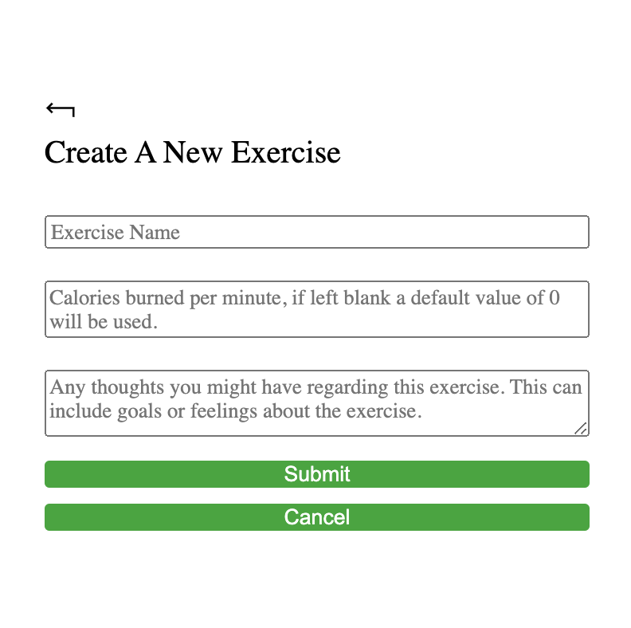
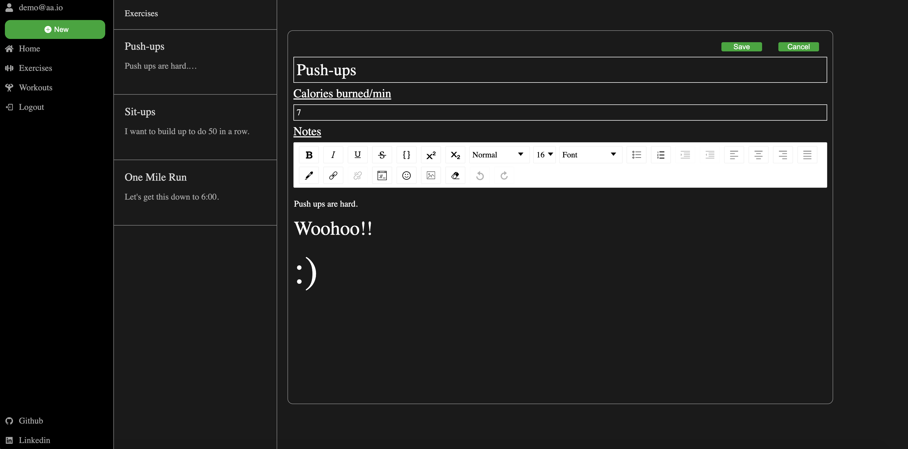
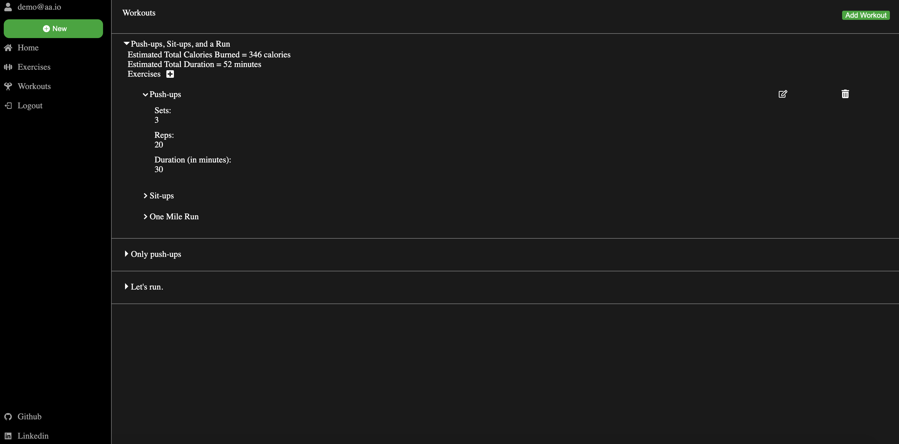

# ActivNote

### [ActivNote](https://activnote.herokuapp.com/) is an Evernote inspired website designed for its users to be able to make their own custom workouts, defined by the exercises they created. This app was made with a Python backend and a JavaScript frontend.

## To learn more about ActivNote, you can check out the wiki!
  * MVP - https://github.com/jimsonm/ActivNote/wiki/MVP-List
  * Backend Routes - https://github.com/jimsonm/ActivNote/wiki/Backend-Routes
  * Frontend Routes - https://github.com/jimsonm/ActivNote/wiki/Frontend-Routes
  * Database Schema - https://github.com/jimsonm/ActivNote/wiki/Database-Schema
  * User Stories - https://github.com/jimsonm/ActivNote/wiki/User-Stories
  
## Technologies Used
  * Docker
  * PostgreSQL
  * Python
  * JavaScript
  * React
  * Redux
  * Flask-SQLAlchemy
  * HTML
  * CSS
  * Heroku

## Home Page
 

</img>

 

## Creating an Exercise
 

</img>

 

## Editting an Exercise
 

</img>

 

## Viewing your Workouts
 

</img>

 

## Future Features:
- [ ] Music Player
- [ ] Rendering extra workout details (total calories and total workout duration)
- [ ] Rich-text Editor for the exercise notes
- [ ] Search feature for the notes
